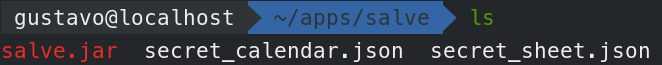
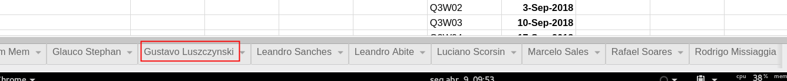
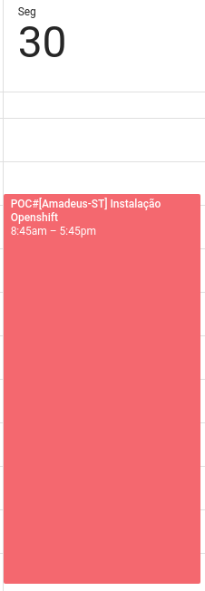
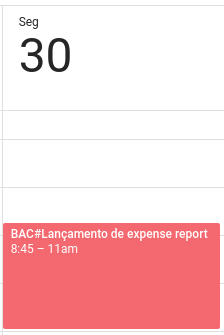
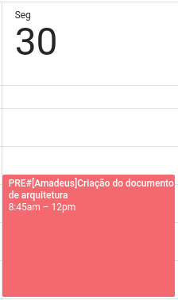
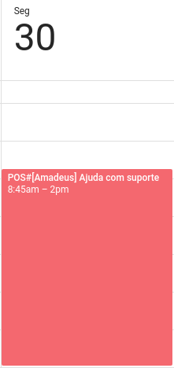
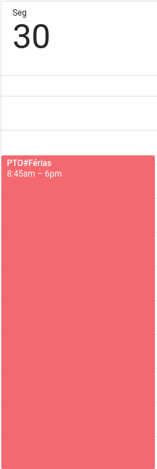
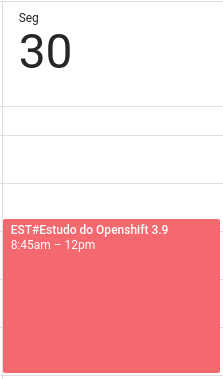
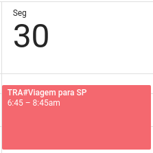

# Salve

Preenchimento automático da planilha dos SAs.

## Preparação

Clone esse repo
```
git clone https://github.com/luszczynski/salve.git && cd salve
```

Faça o build da app:
```
mvn clean package
```

Vamos criar uma variável temporária do local da instalação do `salve`

```
export SALVE_HOME=$HOME/apps/salve
```

Crie a pasta $SALVE_HOME e copie o JAR
```
mkdir $SALVE_HOME && cp target/salve-0.0.1-SNAPSHOT.jar $SALVE_HOME/salve.jar
```

Cria suas credencias do google para o calendar e para o sheet.

* Para o google calendar, acesse https://developers.google.com/calendar/quickstart/java e execute o `step 1` salvando o arquivo json gerado na pasta $HOME/apps/salve/secret_calendar.json


* Para o google sheet, acesse https://developers.google.com/sheets/api/quickstart/java e execute o `step 1` salvando o arquivo json gerado na pasta $HOME/apps/salve/secret_sheet.json


Ao final, a sua pasta `salve` deve ter os arquivos:



Crie o arquivo `config.properties` na pasta `salve` conforme exemplo abaixo:

```
cat <<EOF > $SALVE_HOME/config.properties
# Id da planilha no drive
# Geralmente não há necessidade de alterar esse valor
spreadsheetId=11UFNVm526rCuBJgiEKFDHK7cTX6IoHFjZ7rIDqIqJtI

# Range na planilha do Boris das semanas do quarter e os seus respectivos dias
# Geralmente não há necessidade de alterar esse valor
rangeQuarterWeek=Listas!F1:G

# Range da lista de atividades padrões na planilha do Boris
# Geralmente não há necessidade de alterar esse valor
rangeListaAtividades=Listas!A:A

# Range das cells do usuario que serão escritas (ignora a primeira linha - cabeçalho)
# Geralmente não há necessidade de alterar esse valor
userRangeWeeks=!A2:A

# Nome do usuario. Deve ser o mesmo que estão escrito na aba da planilha do Boris
#### ALTERE ESSE VALOR DE ACORDO COM O SEU NOME NA ABA DA PLANILHA ####
user="Gustavo Luszczynski"

# Caso não seja preenchido TIPO DA CONTA, será utilizado esse valor como padrão.
defaultAccountType="GV"

# Path para o caminho do arquivo de secrets do calendario do google
# Se comentado, ele tenta ler do arquivo de nome secret_calendar.json
#secret_calendar="my_secret_calendar.json"

# Path para o caminho do arquivo de secrets do google spreadsheet do google
# Se comentado, ele tenta ler do arquivo de nome secret_sheet.json
#secret_sheet="my_secret_sheet.json"
EOF
```

Altere no `config.properties` o valor do campo `user` para o seu nome que aparece na aba da planilha do Boris.



```
...
user="Gustavo Luszczynski"
...
```

Sua pasta `salve` no final deve ter os arquivos:

├── config.properties  
├── salve.jar  
├── secret_calendar.json  
└── secret_sheet.json  

## Calendário

Antes de executar, os eventos do calendário devem seguir o seguinte formato:

```
TIPO DA ATIVIDADE#[NOME DA CONTA-TIPO DA CONTA]DESCRIÇÃO DA ATIVIDADE
```
Os campos `TIPO DA ATIVIDADE`, `NOME DA CONTA`, `TIPO DA CONTA` e `DESCRIÇÃO DA ATIVIDADE` serão explicados mais abaixo.

> OBS: A quantidade de hora de cada atividade será buscada do seu calendário.

### TIPO DE ATIVIDADE

Os possíveis valores para o campo `TIPO DE ATIVIDADE` são:

* `POC`: Horas utilizadas em POC
* `PRE`: Horas usadas em atividades de pré-vendas
* `POS`: Horas usadas em atividades de pós-vendas
* `BAC`: Trabalho de Backoffice
* `PTO`: Férias/PTO
* `CLI`: Horas em contato direto com clientes
* `PAR`: Horas em contato com Parceiros, Canais, SIs
* `EST`: Horas usadas em estudo
* `TRA`: Translado para outra cidade

### NOME DO CLIENTE

Aqui pode ser qualquer valor. Basta informar o nome do cliente.

### TIPO DA CONTA

Os possíveis valores para o campo `TIPO DA CONTA` são:

* `ST`: Strategic Account
* `EA`: Enterprise Account
* `MM`: Mid-Market
* `SMB`: Indirect Sales
* `GV`: Government
* `CCSP`: Datacenter com contrato

O valor default caso não seja preenchido o campo `TIPO DA CONTA` fica definido na property `defaultAccountType` dentro do arquivo `config.properties`. Altere esse valor para o tipo de conta que você mais atua.

### DESCRIÇÃO DA ATIVIDADE

Campo livre da descrição da sua atividade

## Execução

Para executar o `salve`, basta fazer:
```
java -jar $SALVE_HOME/salve.jar
```

### Exemplos de uso

#### Exemplo 1: PoC em um determinado cliente

```
POC#[Amadeus-ST] Instalação Openshift
```



#### Exemplo 2: Atividade de Backoffice

```
BAC#Lançamento de expense report
```



#### Exemplo 3: Pré Venda

```
PRE#[Amadeus] Criação do documento de arquitetura
```



> INFO: Nesse caso omitimos o `TIPO DO CLIENTE`. Será utilizar o valor definido no campo `defaultAccountType` no arquivo `config.properties`

> INFO: Nesse caso, o cliente é opcional. A descrição poderia ser da seguinte forma:
```
PRE#Criação do documento de arquitetura
```

#### Exemplo 4: Pós Venda

```
POS#[Amadeus] Ajuda com suporte
```



> INFO: Nesse caso, o cliente também é opcional. 

#### Exemplo 5: PTO/Férias

```
PTO#Férias
```



#### Exemplo 6: Atividades com parceiros/canais
TODO

#### Exemplo 7: Estudos

```
EST#Estudo do Openshift 3.9
```



#### Exemplo 8: Translado para outras cidades

```
TRA#Viagem para SP
```


