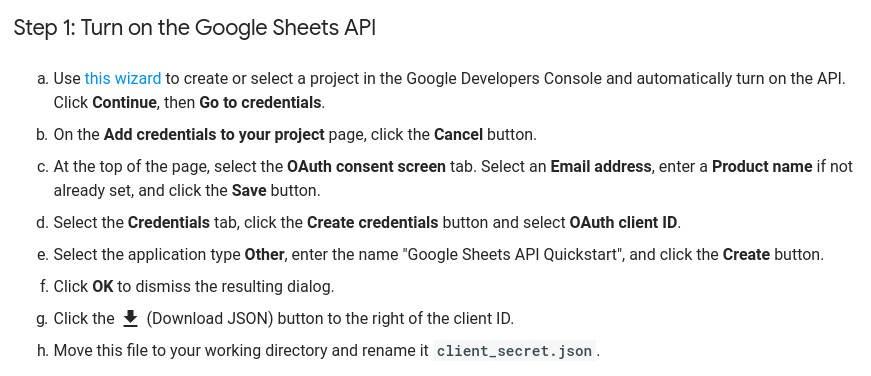

# Salve

Preenchimento automático da planilha dos SAs.

## Instruções de uso

Crie uma pasta
```
mkdir projeto-salve && cd projeto-salve
```

Clone esse repo
```
git clone https://github.com/luszczynski/salve.git && cd salve
```

Execute o goal de package:
```
mvn clean package
```

Cria suas credencias do google para o calendar e para o sheet.

* Para o google calendar, acesse https://developers.google.com/calendar/quickstart/java e execute o `step 1` salvando o arquivo json gerado na pasta projeto-salve


* Para o google sheet, acesse https://developers.google.com/sheets/api/quickstart/java e execute o `step 1` salvando o arquivo json gerado na pasta projeto-salve



Ao final, a sua pasta deve ter os seguinte arquivos:


Agora execute o projeto:

java -jar salve/target/